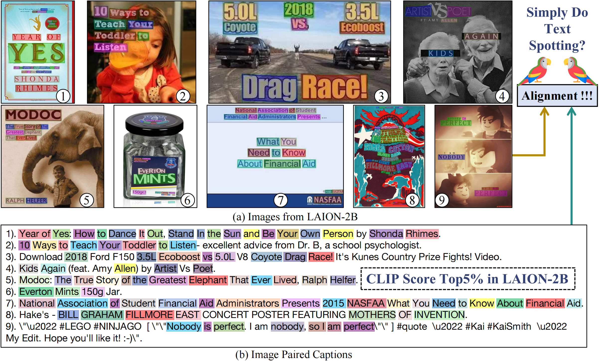

#  Parrot Captions Teach CLIP to Spot Text 

[[ Paper ]](https://arxiv.org/abs/) [[ Website ]](https://linyq17.github.io/CLIP-Parrot-Bias/) [[ Dataset (OpenDataLab)]](https://openxlab.org.cn/datasets/opendatalab-linyiqi/LAION-text-debiased-100M) [[ Dataset (Hugging face) ]](https://huggingface.co/datasets/linyq/laion_text_debiased_100M)




## TL;DR
 
1. Captions in LAION-2B have a significant bias towards describing visual text content embedded in the images.
2. Released CLIP models have strong text spotting bias almost in every style of web images, resulting in the CLIP-filtering datasets inherently biased towards visual text dominant data.
3. CLIP models easily learn text spotting capacity from parrot captions while failing to connect the vision-language semantics, just like a text spotting parrot.
4. We provide a alternative solution by training a less biased filtered LAION-2B 100M subset and pre-trained CLIP models.


## News and Updates
* ```2023.12.22``` 🎉🎉🎉 We release a [technical report]() for more details.
A 100M debiased LAION subset ([**OpenDataLab**](https://openxlab.org.cn/datasets/opendatalab-linyiqi/LAION-text-debiased-100M) and [**Hugging Face**](https://huggingface.co/datasets/linyq/laion_text_debiased_100M). ) and pre-trained models are publicly available.
</br>

## Kmeans Model from LAION-400M

The Kmeans model we trained from LAION-400M dataset CLIP ViT-B-32 features using [fassi](https://github.com/facebookresearch/faiss).
We frist use PCA to reduce the feature dimension.
The training and inference code in kmeans.py.

| PCA weigths | Kmeans centrios |
:---:|:---:
 [Download](https://drive.google.com/file/d/1zJsTGZjtNIoIxbXBjlAXqCJb3AKzjg-0/view?usp=drive_link) | [Download](https://drive.google.com/file/d/1pP5GCBMQTeL34-7uOyundHkkCE-A8xRF/view?usp=drive_link)

## Generating Synthetic Images from N-gram Vocabulary
The generation pipeline of synthetic images (sys_benchmark.py and Arial.ttf) and the N-gram Vocabulary we bulit from the dataset.

| LAION-2B Caption 1-gram | LAION-2B Caption 2-gram | LAION-2B Co-Emb Text 1-gram |
:---:|:---:|:---:
 [Download](https://drive.google.com/file/d/1vFUBQX-cK9JzADuhUa--v7iqQZHElWq_/view?usp=drive_link) | [Download](https://drive.google.com/file/d/1EZJdSOE0QoRvNLVcqfebo73IUfpE_bW-/view?usp=drive_link) | [Download](https://drive.google.com/file/d/1L8VMHXXsPg9niikUPBObw2ZEcb3yurTI/view?usp=drive_link)


## A Less Text-biasd LAION-100M Subset and CLIP Model
### Data Cruation Pipeline
- Selecting all the images without any embedded text using text spotting model [DeepSolo](https://github.com/ViTAE-Transformer/DeepSolo).
- Filtering samples with CLIP score > 0.3 and [Aesthetics score](https://github.com/christophschuhmann/improved-aesthetic-predictor) > 4.5
- Deduplication using CLIP features similarity based cluster labels.
- Finally, we got 107,166,507 (100M) LAION-2B subset.

### Training Details
our training code is based on [OpenCLIP](https://github.com/mlfoundations/open_clip)
- batch size 32k
- lr 5e-4
- epochs 32
- local loss
- precision amp

Note that the OCR model is not perfect, the images in our filtered subset still contain some text content.
Therefore, we also benchmark our trained model on the synthetic images benchmark.

| 100M subset | ViT-B Models |
:---:|:---:
 [Download](https://huggingface.co/datasets/linyq/laion_text_debiased_100M) | [Download](https://drive.google.com/file/d/1yhkaJJCSViUdfXK3o6LnKyvL1LucwtXc/view?usp=sharing)

|  1-gram Synthetic Benchmark | Ours <br>(100M) | CLIP <br>(WIT-400M)| OpenCLIP <br>(LAION-2B)| DC medium  <br> 128M (DC) | DC large <br> 1.28B (DC)
:---:|:---:|:---:|:---:|:---:|:---:
| Sync. Score (mean) $\downarrow$| 0.163 | 0.317 | 0.368 | 0.268 | 0.338 |
| Sync. Score (std) | 0.659 | 0.305 | 0.427 | 0.247 | 0.341 |

|  DataComp benchmark | Ours <br>(100M) | CLIP <br>(WIT-400M)| OpenCLIP <br>(LAION-2B)| DC medium  <br> 128M (DC) | DC large <br> 1.28B (DC)
:---:|:---:|:---:|:---: |:---:|:---:
| ImageNet | 0.526 | 0.633 | 0.666 | 0.176 | 0.459 |
| ImageNet dist. shifts | 0.404  | 0.485 | 0.522 | 0.152|0.378|
| VTAB | 0.481 | 0.526 | 0.565 | 0.259|0.426|
| Retrieval | 0.421 | 0.501 | 0.560 | 0.219 | 0.419 |
| Average | 0.443 | 0.525 | 0.565 | 0.258 | 0.437 |

## Acknowledgement
Thanks for these good works:
+ [faiss](https://github.com/facebookresearch/faiss) A library for efficient similarity search and clustering for buliding Kmeans model.
+ [DeepSolo](https://github.com/ViTAE-Transformer/DeepSolo) A strong transformer based text spotting model for profilling LAION dataset.
+ [CLIP](https://github.com/OpenAI/CLIP) Pre-trained CLIP models on WIT-400M.
+ [OpenCLIP](https://github.com/mlfoundations/open_clip) An open source  CLIP implementation of training codes and pre-trained models on LIAON dataset.
+ [DataComp](https://github.com/mlfoundations/datacomp) A comprehensive evaluation benchmark for CLIP models' downstream performace.
+ [Aesthetic Score Predictor](https://github.com/christophschuhmann/improved-aesthetic-predictor) An aesthetic score predictor ( how much people like on average an image ) based on a simple neural net that takes CLIP embeddings as inputs.

```bibtex
@misc{
}
```


## License
[Apache 2.0 License](LICENSE.md)